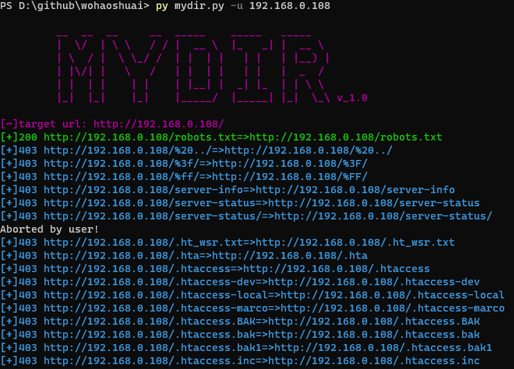

# mydir v1.0

mydir 自用轻量型web目录扫描工具

## 工具特点 ##
目前只写了基础功能，加了字典就能跑。
应用场景：自用。

## 用法 ##
 py mydir.py -h
usage: mydir.py [-h] -u URL [-th THREAD] [-t TIMEOUT] [-e EXTENTION] [-o OUTPUT] [-d DICT] [-s STATUS]

optional arguments:
  -h, --help    show this help message and exit
  -u URL        target url
  -th THREAD    the thread for connecting
  -t TIMEOUT    the timeout for connecting to url
  -e EXTENTION  Suffix name used for fuzzing. [Default: php]
  -o OUTPUT     Output dir
  -d DICT
  -s STATUS     output the status that you want

Example: mydir.py -u http://example.com

## demo ##

## 安装依赖 ##
python3
resquests
colorama
changanya

## TODO ##
- [] 反封禁
  - [] 代理池
  - [] 换headers
  - [] 每过几秒检测与目标的连接 
- [] 字典处理
  - []根据拓展把保留字段换掉
- [] 递归扫描   

## 缺陷 ##
好多403，不知道为啥

## 致谢声明 ##
本工具借鉴了好多开源项目和文章：
https://xz.aliyun.com/t/4404（对404页面可能返回200但是not found内容回显的处理）
wscan开源web目录扫描工具（忘记在哪下载了）
...